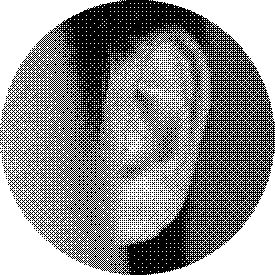
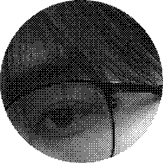
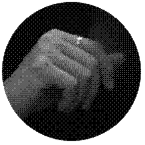
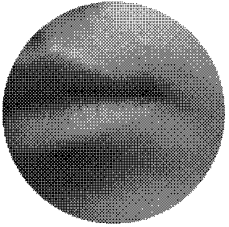
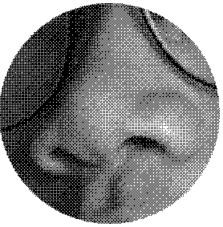

# Fragments of the Self

Edmond Peng

[View this project online]()

## Description

This project is a representation of our fragmented self-image within the digital space. The user can interact with each bitmapped bubbles by hovering the mouse on them and triggering different types of effects.

## Screenshot(s)

Each assets are photos that I took on my camcorder and transferred into Photoshop to apply a bitmapped effect; I then took out the white background using color range to make it translucent and emphasize the layering of each bubbles - further pushing the narrative of deconstruction or construction of identity on the web.

> 

## Attribution

https://p5js.org/reference/p5/p5.Image/
Used this source to learn how to load images properly.

https://p5js.org/reference/p5/ellipse/
Used this source for creating shapes.

https://p5js.org/reference/p5/rotate/
Used this source to rotate the bubbles; eventually found out that it is not very convenient and not optimal for hover effect. Sabine fixed the distance of the bubbles for me (THANK YOU SABINE ONCE AGAIN)

https://p5js.org/reference/p5.Image/resize/
Used this source to resize images, eventually found out it's useless, but still.

https://p5js.org/reference/p5/mouseX/
Used this source for the creation of the line.

https://p5js.org/reference/p5/filter/
Used this source for the filters on the bubbles.

> - This project uses [p5.js](https://p5js.org).

