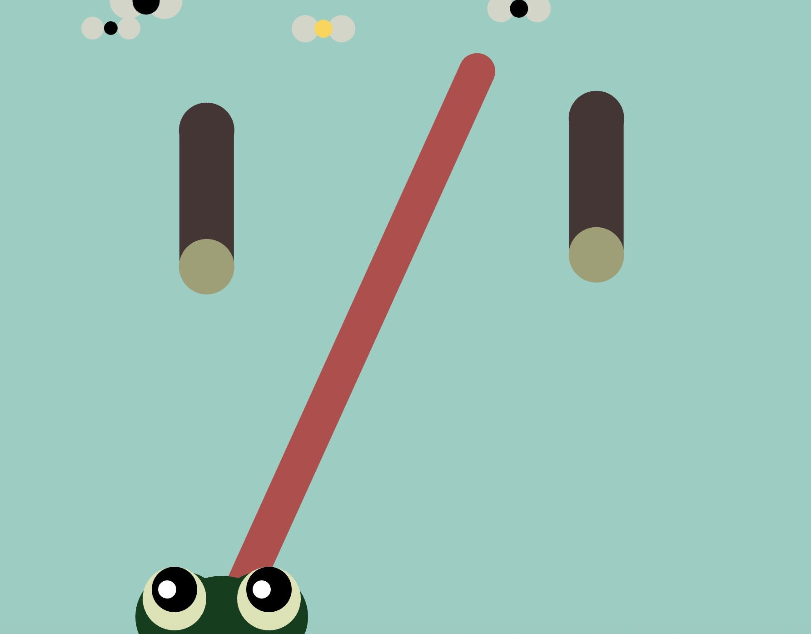

Student Name: Edmond Peng
id: 40250224

The Froggy Feast

A game about a hungry froggy that is swimming and trying to eat flies while avoiding dangerous logs. The objective is to survive as long as possible and eat as many flies as possible to satiate its hunger and make him happy, but be careful, the more flies it eats, the bigger it grows which makes it more susceptible to being hit by a dangerous log. There's also a special bee that it can eat and it instead grows its tongue. As it eats more flies, logs are also falling faster...

Control Instructions

-Click left and right arrow key to move the frog on x axis

-Mouse click to trigger the tongue to its target

-Can do both moves at the same time

Screenshot

JavaScript libraries:

p5.js and p5.sound.js

Sound assets:

https://www.myinstants.com/en/instant/yoshi-tongue/

https://www.myinstants.com/en/instant/roblox-oof/

Font asset:

https://fonts.google.com/specimen/Sour+Gummy

Attributes:

Flies/log parameters codes inspired by Pippin's buzz buzz buzz guide on parameters

Tongue to fly collision code taken directly from the frogfrogfrog project base code

Log to frog collision code made from a mix of tutorials on object collision on YouTube as well as using ChatGPT to troubleshoot errors.
-I had numerous attempts from circle to rect collision, circle to circle collision, ellipse to rect collision, etc.

Display score endscreen codes inspired by the functions course

