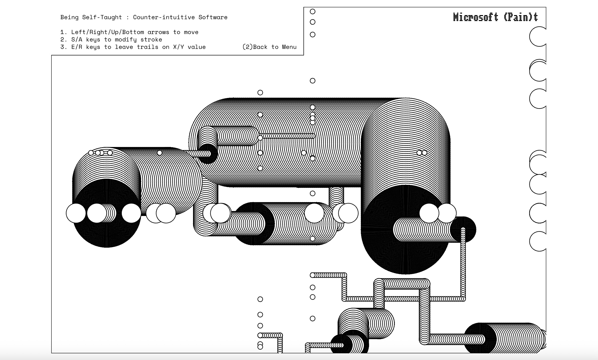
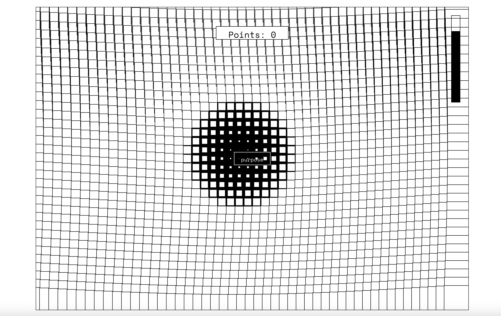

# Design of Anxiety

Edmond Peng

[View this project online](https://edmondpeng123.github.io/cart253/topics/variations-jam)

## Description

A playful web exploration on the experience of an anxious student getting through his Design degree while dealing
with different sorts of difficulties.

Design of Anxiety is a web platform that holds three mini-games inspired by the struggles of an anxious design student. 

Rumination (Imposter Syndrome) is a game where the player has to avoid random anxious thought bubbles that are appearing at different speeds and if they get hit by too many, then their mental health deteriorates until they mentally burn out and the game stops.

Microsoft (Pain)t is a counter-intuitive rudimentary drawing tool that attempts to emulate the feeling of confusion when learning a
design software for the first time. The user can play around the keys and create art for fun.

Design ethos? is a searching game that makes reference to the stress that design students undertake as they enter their final year
and have to rethink their career path, their purpose, their design ethos. They have to find purpose as many times as possible before time
runs out.

## Screenshot(s)

> 

## Attribution

-this project uses [p5.js](https://p5js.org).
-all screenshots were taken on my mac
-the ethos mini game main grid array interface was inspired by this tutorial: https://www.youtube.com/watch?v=AVMSCFMCz9w
-i used ChatGPT and Gemini to troubleshoot some of the codes, especially for the collision and the mouse press function in the ethos mini game.
-fonts were taken from Google fonts : Workbench for the main titles and Space Mono for the text bits.
## License
